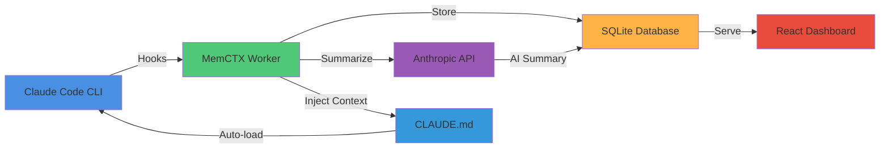

<div align="center">

# 🧠 MemCTX

<h3 align="center">Autonomous Session Memory for Claude Code</h3>

<p align="center">
  <strong>Never lose context. Never repeat yourself. Your AI pair programmer, now with perfect memory.</strong>
</p>

<p align="center">
  <a href="https://www.npmjs.com/package/memctx"></a>
  <a href="https://www.npmjs.com/package/memctx"></a>
  <a href="https://opensource.org/licenses/MIT"></a>
  <a href="https://nodejs.org"></a>
</p>

<p align="center">
  <a href="#-quick-start">🚀 Quick Start</a> •
  <a href="#-documentation">📖 Documentation</a> •
  <a href="#-features">✨ Features</a> •
  <a href="#-demo">🎯 Demo</a> •
  <a href="#-community">💬 Community</a>
</p>

<br />


<br />
<br />

</div>

<br />

---

<br />

## 🎯 What is MemCTX?

<p align="center" style="font-size: 1.1em; max-width: 900px; margin: 0 auto;">
MemCTX transforms Claude Code into a <strong>context-aware development companion</strong> by automatically capturing, analyzing, and intelligently injecting your development history. Think of it as giving Claude a <strong>photographic memory</strong> of your entire project journey.
</p>

<br />

<table width="100%">
<tr>
<td width="50%" valign="top">

### 😫 Before MemCTX

- ❌ Repeat context every session
- ❌ Lost conversation history
- ❌ Manual session notes
- ❌ Forgotten decisions
- ❌ Context switching overhead

</td>
<td width="50%" valign="top">

### ✨ With MemCTX

- ✅ Automatic context injection
- ✅ Searchable session history
- ✅ AI-powered summaries
- ✅ Decision tracking
- ✅ Seamless continuity

</td>
</tr>
</table>

<br />

---

<br />

## ✨ Features

<br />

<table width="100%">
<tr>
<td width="33%" align="center" valign="top">

### 🧠 Smart Memory

Automatically captures every Claude Code session with full context preservation

</td>
<td width="33%" align="center" valign="top">

### 🤖 AI Summaries

Claude analyzes each session and generates structured summaries with key insights

</td>
<td width="33%" align="center" valign="top">

### 📊 Beautiful Dashboard

Modern, responsive UI to browse, search, and analyze your development history

</td>
</tr>
<tr>
<td width="33%" align="center" valign="top">

### 🔍 Full-Text Search

Lightning-fast search across all sessions, conversations, and code snippets

</td>
<td width="33%" align="center" valign="top">

### 📈 Live Monitoring

Real-time view of active sessions with WebSocket updates

</td>
<td width="33%" align="center" valign="top">

### 🎯 Context Injection

Automatically injects relevant history into new sessions for perfect continuity

</td>
</tr>
<tr>
<td width="33%" align="center" valign="top">

### 🏷️ Tags & Bookmarks

Organize sessions with custom tags and bookmark important moments

</td>
<td width="33%" align="center" valign="top">

### 📝 Session Notes

Add custom notes and annotations to any session

</td>
<td width="33%" align="center" valign="top">

### 🌓 Dark/Light Theme

Beautiful themes that adapt to your preference

</td>
</tr>
</table>

<br />

---

<br />

## 🚀 Quick Start

<br />

<details open>
<summary><h3>📦 Installation</h3></summary>

<br />

```bash
# Install globally with npm
npm install -g memctx

# Or with pnpm (recommended)
pnpm add -g memctx

# Or with yarn
yarn global add memctx
```

**Current Version:** `1.0.4` | **Node Required:** `>=18.0.0`

</details>

<br />

<details open>
<summary><h3>⚡ Setup (30 seconds)</h3></summary>

<br />

```bash
# 1. Install and configure hooks
memctx install

# 2. Start the service
memctx start

# 3. Open the dashboard
memctx open
```

<p align="center"><strong>That's it! 🎉</strong> MemCTX is now capturing your Claude Code sessions automatically.</p>

</details>

<br />

<details>
<summary><h3>🔧 Configuration</h3></summary>

<br />

#### Settings Dashboard (Recommended)

Open `http://localhost:9999/settings` and configure:

- **API Provider**: Direct (Anthropic) or Proxy (9router, etc.)
- **API Key**: Your Anthropic or proxy API key
- **Model**: Choose Claude Opus, Sonnet, Haiku, or AWS default
- **Disable Summaries**: Toggle to save API costs

<br />

#### Environment Variables (Alternative)

```bash
# Required for AI summaries
export ANTHROPIC_API_KEY="sk-ant-..."

# Optional: Use proxy
export ANTHROPIC_BASE_URL="https://your-proxy.com/v1"

# Optional: Custom port (default: 9999)
export MEMCTX_PORT=8080

# Optional: Custom database location
export MEMCTX_DB_PATH="/path/to/db.sqlite"
```

</details>

<br />

---

<br />

## 💻 CLI Commands

<br />

<table width="100%">
<tr>
<th width="30%">Command</th>
<th width="70%">Description</th>
</tr>
<tr>
<td><code>memctx install</code></td>
<td>Install hooks and start daemon</td>
</tr>
<tr>
<td><code>memctx start</code></td>
<td>Start the worker daemon</td>
</tr>
<tr>
<td><code>memctx stop</code></td>
<td>Stop the worker daemon</td>
</tr>
<tr>
<td><code>memctx restart</code></td>
<td>Restart the worker daemon</td>
</tr>
<tr>
<td><code>memctx status</code></td>
<td>Show daemon status and health check</td>
</tr>
<tr>
<td><code>memctx open</code></td>
<td>Open dashboard in browser</td>
</tr>
<tr>
<td><code>memctx search &lt;query&gt;</code></td>
<td>Search sessions from terminal</td>
</tr>
<tr>
<td><code>memctx export</code></td>
<td>Export all sessions as markdown</td>
</tr>
<tr>
<td><code>memctx config</code></td>
<td>Show configuration</td>
</tr>
<tr>
<td><code>memctx uninstall</code></td>
<td>Remove hooks and stop daemon</td>
</tr>
</table>

<br />

---

<br />

## 🎯 Demo

<br />

<div align="center">

### Dashboard Overview


<br />
<br />

### Session Details


<br />
<br />

### Search & Filter


</div>

<br />

---

<br />

## 🏗️ How It Works

<br />



<br />

<details>
<summary><h3>📋 Detailed Flow</h3></summary>

<br />

1. **Session Start**: Claude Code session begins → `session-start` hook fires
2. **Capture**: MemCTX worker creates session record in SQLite
3. **Observe**: Every tool use is captured via `post-tool-use` hook
4. **End**: Session ends → `stop` hook fires
5. **Summarize**: Worker sends transcript to Claude for AI analysis
6. **Store**: Summary stored in database
7. **Inject**: Next session auto-loads relevant context from `CLAUDE.md`
8. **Browse**: View everything in the beautiful dashboard

</details>

<br />

---

<br />

## 📖 Documentation

<br />

<div align="center">

### [📚 Complete Documentation →](./docs/README.md)

</div>

<br />

<table width="100%">
<tr>
<td width="50%" valign="top">

### 📚 For Users

- [📦 Installation Guide](./docs/user/installation.md)
- [⚙️ Configuration](./docs/user/configuration.md)
- [💻 CLI Reference](./docs/user/cli-reference.md)
- [🎨 Dashboard Guide](./docs/user/dashboard.md)
- [🔧 Troubleshooting](./docs/user/troubleshooting.md)

</td>
<td width="50%" valign="top">

### 🛠️ For Developers

- [🏗️ Architecture](./docs/developer/architecture.md)
- [🔌 API Reference](./docs/developer/api-reference.md)
- [🤝 Contributing Guide](./docs/developer/contributing.md)
- [🔧 Development Setup](./docs/developer/development.md)
- [🔌 Plugin System](./docs/developer/plugin-system.md)

</td>
</tr>
</table>

<br />

---

<br />

## 🔧 Requirements

<br />

<table width="100%">
<tr>
<td width="50%" valign="top">

### System Requirements

- **Node.js**: 18.0.0 or higher
- **Claude Code**: CLI installed
- **OS**: Linux, macOS, or Windows (WSL)

</td>
<td width="50%" valign="top">

### Build Tools (for installation)

- **Linux**: `build-essential`, `python3`
- **macOS**: Xcode Command Line Tools
- **Windows**: Visual Studio Build Tools

</td>
</tr>
</table>

<br />

<details>
<summary><h3>🔨 Installing Build Tools</h3></summary>

<br />

**Linux (Ubuntu/Debian):**
```bash
sudo apt install build-essential python3
```

**macOS:**
```bash
xcode-select --install
```

**Windows:**
Install [Visual Studio Build Tools](https://visualstudio.microsoft.com/downloads/#build-tools-for-visual-studio-2022)

</details>

<br />

---

<br />

## 🎨 Dashboard Features

<br />

<table width="100%">
<tr>
<td width="33%" align="center" valign="top">

### 📊 Projects View

Browse all projects and their sessions organized by directory

</td>
<td width="33%" align="center" valign="top">

### 🔍 Search

Full-text search with filters, tags, and date ranges

</td>
<td width="33%" align="center" valign="top">

### 📈 Live Monitor

Real-time view of active sessions with WebSocket updates

</td>
</tr>
<tr>
<td width="33%" align="center" valign="top">

### 📝 Session Details

View full conversation history, summaries, and observations

</td>
<td width="33%" align="center" valign="top">

### 🏷️ Tags & Notes

Organize with custom tags and add notes to sessions

</td>
<td width="33%" align="center" valign="top">

### 📊 Metrics

System performance, API usage, and statistics

</td>
</tr>
<tr>
<td width="33%" align="center" valign="top">

### 🌓 Themes

Beautiful dark and light themes

</td>
<td width="33%" align="center" valign="top">

### ⌨️ Shortcuts

Keyboard shortcuts for power users (press `?`)

</td>
<td width="33%" align="center" valign="top">

### 📤 Export

Export sessions as markdown or screenshots

</td>
</tr>
</table>

<br />

---

<br />

## 🚨 Troubleshooting

<br />

<details>
<summary><h3>Service won't start</h3></summary>

<br />

```bash
# Check if port is in use
lsof -i :9999

# Check logs
tail -f /tmp/memctx.log

# Restart service
memctx restart
```

</details>

<br />

<details>
<summary><h3>Hooks not working</h3></summary>

<br />

```bash
# Verify hooks are registered
cat ~/.claude/settings.json | grep memctx

# Reinstall hooks
memctx uninstall
memctx install
```

</details>

<br />

<details>
<summary><h3>SQLite compilation errors</h3></summary>

<br />

```bash
# Rebuild native modules
npm rebuild better-sqlite3

# Or reinstall
npm uninstall -g memctx
npm install -g memctx
```

</details>

<br />

<details>
<summary><h3>AI summaries not working</h3></summary>

<br />

```bash
# Check API key is set
echo $ANTHROPIC_API_KEY

# Set API key
export ANTHROPIC_API_KEY="sk-ant-..."

# Or configure in dashboard
memctx open
# Navigate to Settings
```

</details>

<br />

---

<br />

## 🤝 Contributing

<br />

<p align="center">We love contributions! MemCTX is open source and community-driven.</p>

<br />

<table width="100%">
<tr>
<td width="33%" align="center" valign="top">

### 🐛 Report Bugs

[Open an issue](https://github.com/bbhunterpk-ux/memctx/issues/new?template=bug_report.md)

</td>
<td width="33%" align="center" valign="top">

### 💡 Request Features

[Suggest a feature](https://github.com/bbhunterpk-ux/memctx/issues/new?template=feature_request.md)

</td>
<td width="33%" align="center" valign="top">

### 🔧 Submit PRs

[Contributing Guide](https://github.com/bbhunterpk-ux/memctx/blob/main/CONTRIBUTING.md)

</td>
</tr>
</table>

<br />

<details>
<summary><h3>Development Setup</h3></summary>

<br />

```bash
# Clone repository
git clone https://github.com/bbhunterpk-ux/memctx.git
cd memctx

# Install dependencies
pnpm install

# Build
pnpm run build

# Link locally
npm link

# Test
memctx install
memctx start
```

</details>

<br />

---

<br />

## 💬 Community

<br />

<div align="center">

[](https://github.com/bbhunterpk-ux/memctx/discussions)
[](https://discord.gg/memctx)
[](https://twitter.com/memctx)

</div>

<br />

<table width="100%">
<tr>
<td width="33%" align="center" valign="top">

### 💬 GitHub Discussions

Ask questions, share ideas

</td>
<td width="33%" align="center" valign="top">

### 💭 Discord

Real-time chat with the community

</td>
<td width="33%" align="center" valign="top">

### 🐦 Twitter

Follow for updates and tips

</td>
</tr>
</table>

<br />

---

<br />

## 📊 Stats

<br />

<div align="center">


</div>

<br />

---

<br />

## 🗺️ Roadmap

<br />

<table width="100%">
<tr>
<th width="33%">✅ v1.0 (Current)</th>
<th width="33%">🚧 v1.1 (Next)</th>
<th width="33%">🔮 v2.0 (Future)</th>
</tr>
<tr>
<td valign="top">

- [x] Session capture
- [x] AI summaries
- [x] Dashboard UI
- [x] Search & filter
- [x] Tags & bookmarks
- [x] Export functionality

</td>
<td valign="top">

- [ ] Team collaboration
- [ ] Cloud sync
- [ ] VS Code extension
- [ ] Advanced analytics
- [ ] Custom plugins
- [ ] API webhooks

</td>
<td valign="top">

- [ ] Multi-user support
- [ ] Enterprise features
- [ ] Advanced AI insights
- [ ] Integration marketplace
- [ ] Mobile app
- [ ] Self-hosted option

</td>
</tr>
</table>

<br />

---

<br />

## 📄 License

<br />

<p align="center">MemCTX is <a href="LICENSE">MIT licensed</a>.</p>

<br />

```
MIT License

Copyright (c) 2026 Fahad Aziz Qureshi

Permission is hereby granted, free of charge, to any person obtaining a copy
of this software and associated documentation files (the "Software"), to deal
in the Software without restriction, including without limitation the rights
to use, copy, modify, merge, publish, distribute, sublicense, and/or sell
copies of the Software, and to permit persons to whom the Software is
furnished to do so, subject to the following conditions:

The above copyright notice and this permission notice shall be included in all
copies or substantial portions of the Software.
```

<br />

---

<br />

## 🙏 Acknowledgments

<br />

<p align="center"><strong>Built with ❤️ using:</strong></p>

<br />

<div align="center">

[](https://claude.ai)
[](https://expressjs.com)
[](https://react.dev)
[](https://sqlite.org)
[](https://vitejs.dev)

</div>

<br />

<p align="center"><strong>Special thanks to:</strong></p>

<table width="100%">
<tr>
<td width="33%" align="center" valign="top">

### 🤖 Anthropic

For Claude AI

</td>
<td width="33%" align="center" valign="top">

### 👥 Community

The Claude Code community

</td>
<td width="33%" align="center" valign="top">

### 🙌 Contributors

All our contributors and users

</td>
</tr>
</table>

<br />

---

<br />

## 📞 Support

<br />

<table width="100%">
<tr>
<td width="50%" align="center" valign="top">

### 📧 Email

[info@memctx.dev](mailto:info@memctx.dev)

</td>
<td width="50%" align="center" valign="top">

### 🌐 Website

[memctx.dev](https://memctx.dev)

</td>
</tr>
<tr>
<td width="50%" align="center" valign="top">

### 🐛 Issues

[GitHub Issues](https://github.com/bbhunterpk-ux/memctx/issues)

</td>
<td width="50%" align="center" valign="top">

### 💬 Discussions

[GitHub Discussions](https://github.com/bbhunterpk-ux/memctx/discussions)

</td>
</tr>
</table>

<br />

---

<br />

<div align="center">

<br />

### ⭐ Star us on GitHub — it motivates us a lot!

<br />

[](https://star-history.com/#bbhunterpk-ux/memctx&Date)

<br />
<br />

---

<br />

**Made with ❤️ by [Fahad Aziz Qureshi](https://memctx.dev)**

*Empowering developers with perfect AI memory*

<br />

[⬆ Back to Top](#-memctx)

<br />

</div>
