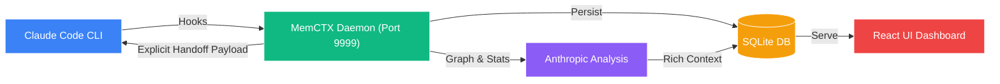

<div align="center">


<br/>

# MemCTX

<h3>Autonomous Session Memory & Context Handoff for Claude Code</h3>

<p><i>Never repeat yourself. Your AI pair programmer, now with world-class memory.</i></p>

<br/>

<a href="https://www.npmjs.com/package/memctx"></a>
<a href="https://www.npmjs.com/package/memctx"></a>
<a href="https://opensource.org/licenses/MIT"></a>
<a href="https://nodejs.org"></a>
<a href="https://github.com/bbhunterpk-ux/memctx/stargazers"></a>

<br/><br/>

**[🚀 Quick Start](#-quick-start)** &nbsp;·&nbsp; **[✨ Features](#-features)** &nbsp;·&nbsp; **[🏗️ Architecture](#-architecture)** &nbsp;·&nbsp; **[💻 CLI](#-cli-reference)** &nbsp;·&nbsp; **[⚙️ Config](#-configuration)**

<br/><br/>


<br/>

---

<br/>

### 😤 Tired of this?

```
You:     "As I mentioned before, we're using a monorepo with Turborepo..."
Claude:  "Got it! So tell me about your architecture..."
You:     *screams internally*
```

### 😌 Welcome to this.

```
Claude:  "Resuming your monorepo session. You left off mid-refactor on
          auth/middleware.ts. 3 open rabbit holes, 1 tech debt item flagged.
          Picking up exactly where you left off..."
You:     *exhales*
```

</div>

<br/>

---

<br/>

## 🆚 Before & After

<br/>

<div align="center">

| | 😫 **Without MemCTX** | ✅ **With MemCTX** |
|:---:|:---|:---|
| **Context** | Re-explained every single session | Auto-injected at session start |
| **History** | Gone when you close the terminal | Persisted forever in a local graph |
| **Handoffs** | Manual notes (that you forget) | AI-generated `START HERE` markers |
| **Tech Debt** | Silently piling up | Tracked, flagged, and surfaced |
| **Rabbit Holes** | Lost forever | Catalogued and recalled |
| **Privacy** | Dependent on the cloud | 100% local — SQLite, your machine |

</div>

<br/>

---

<br/>

## ✨ Features

<br/>

### 🧠 &nbsp; World-Class Memory

MemCTX silently watches every Claude Code session and extracts what matters — decisions made, files touched, patterns emerging. It even tracks **gamified session metrics**:

- 💡 **Aha! Moments** — breakthroughs and key realizations
- 🌀 **Divergence Score** — how far you strayed from the original plan
- 🔥 **Flow State** — deep-focus stretches worth protecting

<br/>

### 🤖 &nbsp; Explicit AI Handoffs

At the end of every session, Claude writes a structured handoff payload. The *next* session receives it as part of its system prompt — no manual copy-paste, no context loss.

Every handoff includes:

```
▸ START HERE        → Exact next steps, ranked by priority
▸ Open Rabbit Holes → Threads worth revisiting
▸ Tech Debt         → What got deferred and why
▸ Architectural Drift → Decisions that may need revisiting
```

<br/>

### 🏗️ &nbsp; Knowledge Graph Architecture

All context is unified into a **persistent local graph database**. File-function relationships, decision chains, and dependency maps are extracted in a single optimized pass — no redundant re-analysis, no bloat.

<br/>

### 📊 &nbsp; Beautiful React Dashboard

A modern, responsive React SPA available at `http://localhost:9999`. Visualize:

- Session telemetry and flow timelines
- Tool usage heatmaps
- Your full node/edge knowledge graph
- Tech debt history and trend lines

<br/>

### ⚡ &nbsp; Incremental Snapshots — Privacy First

Long sessions are safely chunked via a **hybrid 10-turn / 5-minute trigger** strategy. Nothing is ever lost mid-session. Everything runs **locally via SQLite** — no data leaves your machine. The daemon runs quietly on port `9999`.

<br/>

---

<br/>

## 🚀 Quick Start

<br/>

### 1 — Install

```bash
# Strongly recommended
pnpm add -g memctx

# Alternatives
npm install -g memctx
yarn global add memctx
```

<br/>

### 2 — Setup *(30 seconds)*

```bash
memctx install   # Hooks into Claude Code via ~/.claude/settings.json
memctx start     # Boots the local background daemon
memctx open      # Opens the React dashboard in your browser
```

<br/>

### 3 — Use Claude Normally

```bash
claude
```

> That's it. MemCTX runs silently in the background — capturing, analyzing, and injecting context on every session automatically.

<br/>

---

<br/>

## 🏗️ Architecture

<br/>

<div align="center">



</div>

<br/>

**How it flows:**

1. `memctx install` injects hooks into `~/.claude/settings.json`
2. `memctx start` boots the background daemon
3. **Session start** → MemCTX computes prior context, tech debt, and next steps — piped directly into Claude's system prompt
4. **Live** → background worker snapshots every 10 turns or 5 minutes
5. **Session end** → Claude extracts gamified stats and writes the handoff payload to SQLite
6. **Dashboard** → React SPA reads from SQLite and renders your full timeline, metrics, and graph

<br/>

---

<br/>

## 💻 CLI Reference

<br/>

| Command | What it does |
|:---|:---|
| `memctx install` | Register hooks into Claude Code + start daemon |
| `memctx start` | Boot the background worker daemon |
| `memctx stop` | Gracefully stop the daemon |
| `memctx status` | Daemon health check + SQLite diagnostics |
| `memctx open` | Open the React dashboard in your browser |
| `memctx search <query>` | Full-text session search from the terminal |
| `memctx export` | Export all sessions to clean Markdown files |
| `memctx uninstall` | Remove all hooks + stop daemon completely |

<br/>

---

<br/>

## ⚙️ Configuration

<br/>

MemCTX works out of the box. Fine-tune it at `http://localhost:9999/settings` or via environment variables:

```bash
# Required — powers rich summaries and AI handoff generation
export ANTHROPIC_API_KEY="sk-ant-..."

# Optional
export ANTHROPIC_BASE_URL="..."             # Proxy support (e.g. 9router)
export MEMCTX_PORT=8080                     # Custom daemon port (default: 9999)
export MEMCTX_DB_PATH="/path/to/db.sqlite"  # Custom SQLite path
```

<br/>

---

<br/>

<div align="center">

## ⭐ Star MemCTX

**If MemCTX saves you even one *"wait, where were we?"* moment — star it.**
It genuinely helps the project grow.

<br/>

[](https://github.com/bbhunterpk-ux/memctx)

<br/>

[](https://star-history.com/#bbhunterpk-ux/memctx&Date)

<br/>

---

<br/>

[](https://github.com/bbhunterpk-ux/memctx/discussions)
&nbsp;&nbsp;
[](https://discord.gg/memctx)
&nbsp;&nbsp;
[](https://twitter.com/memctx)

<br/>

**MIT Licensed** &nbsp;·&nbsp; Made with ❤️ by [Fahad Aziz Qureshi](https://memctx.dev) &nbsp;·&nbsp; [Contribute](https://github.com/bbhunterpk-ux/memctx/blob/main/CONTRIBUTING.md)

<br/>

</div>
