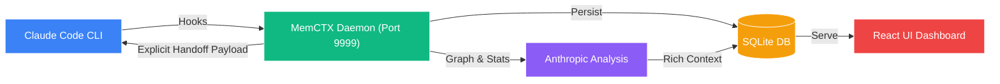

<div align="center">

#  MemCTX

**Autonomous Session Memory & Context Handoff for Claude Code**
*Never repeat yourself. Your AI pair programmer, now with world-class memory.*

[](https://www.npmjs.com/package/memctx)
[](https://www.npmjs.com/package/memctx)
[](https://opensource.org/licenses/MIT)
[](https://nodejs.org)

[🚀 Quick Start](#-quick-start) •
[✨ Features](#-key-features) •
[🏗️ Architecture](#-how-it-works) •
[💻 CLI Commands](#-cli-reference)


</div>

---

## ⚡ The Problem vs The Solution

MemCTX transforms Claude Code into a **context-aware development companion** by automatically capturing, analyzing, and intelligently injecting your development history. Think of it as giving Claude a **photographic memory** of your entire project journey.

| 😫 Without MemCTX | ✨ With MemCTX |
| :--- | :--- |
| **❌ Repeating Context** every session | **✅ Automatic Injection** of critical context |
| **❌ Lost History** when closing terminal | **✅ Persistent Graph** of all past decisions |
| **❌ Manual Notes** for handoffs | **✅ AI Handoffs** indicating where to start next |
| **❌ Unnoticed Tech Debt** accumulation | **✅ Telemetry & Metrics** tracking Tech Debt |

---

## ✨ Key Features

<details open>
<summary><b style="font-size: 1.1em;">🧠 World-Class Memory</b></summary>
Automatically captures every Claude Code session, extracting gamification metrics like <b>Aha! moments</b>, <b>Divergence</b>, and <b>Flow State</b>.
</details>

<details open>
<summary><b style="font-size: 1.1em;">🤖 Explicit AI Handoffs</b></summary>
Claude analyzes each session and passes it on. The next session gets explicit <code>START HERE</code> markers, <b>Open Rabbit Holes</b>, <b>Tech Debt</b>, and <b>Architectural Drift</b>.
</details>

<details open>
<summary><b style="font-size: 1.1em;">🏗️ Knowledge Graph Architecture</b></summary>
Unifies your context into a persistent graph database. Extracts complex file-function relationships in a single optimized pass.
</details>

<details open>
<summary><b style="font-size: 1.1em;">📊 Beautiful React Dashboard</b></summary>
Modern, responsive UI visualizing session telemetry, tool usage, and your node/edge graph layout in seconds.
</details>

<details open>
<summary><b style="font-size: 1.1em;">⚡ Incremental Snapshots & Privacy-First</b></summary>
Long sessions are safely chunked via hybrid 10-turn / 5-minute triggers. Everything runs locally via SQLite. The global daemon operates efficiently out of the way on port 9999.
</details>

---

## �� Quick Start

### 1. Installation

```bash
# Strongly recommended
pnpm add -g memctx

# Alternatives
npm install -g memctx
yarn global add memctx
```

### 2. Setup (30 seconds)

```bash
memctx install  # Registers Claude Code hooks
memctx start    # Boots the backend daemon
memctx open     # Opens your dashboard
```

> **You're all set!** MemCTX is now silently backing up and injecting context behind the scenes. Start a session by running `claude`.

---

## 🏗️ How It Works

<div align="center">



</div>

1. **Initialization:** `memctx start` boots the local daemon.
2. **Seamless Hooks:** MemCTX injects directly into Claude Code via `~/.claude/settings.json`.
3. **Session Start:** MemCTX computes past context, open tech debt, and immediate next steps, piping it directly into Claude's System Prompt via the `SessionStart` hook.
4. **Live Telemetry:** A background worker monitors streams via a hybrid 10-turn or 5-minute snapshot strategy.
5. **Session Extraction:** MemCTX analyzes gamified session stats (Aha! moments, tech debt, flow states). 
6. **Dashboard Visualization:** Review your timeline, metrics, and architecture maps in a beautiful React SPA!

---

## 💻 CLI Reference

| Command | Description |
| :--- | :--- |
| `memctx install` | Install hooks and start daemon |
| `memctx start` | Boot the background worker daemon |
| `memctx stop` | Stop the background worker daemon |
| `memctx status` | Show daemon status and SQLite health |
| `memctx open` | Open the React dashboard in your browser |
| `memctx search <Q>` | Search sessions directly from the terminal |
| `memctx export` | Export all sessions to clean Markdown files |
| `memctx uninstall` | Remove all hooks and gracefully stop daemon |

---

## 🔧 Configuration

While MemCTX typically runs instantly out of the box, you can fine-tune it in `http://localhost:9999/settings` or via environment variables:

```bash
export ANTHROPIC_API_KEY="sk-ant-..."      # Required for rich summaries
export ANTHROPIC_BASE_URL="..."            # Support for proxies like 9router
export MEMCTX_PORT=8080                    # Custom Daemon Port (Default: 9999)
export MEMCTX_DB_PATH="/path/to/db.sqlite" # Custom DB path
```

---

<div align="center">

### ⭐ Star us on GitHub — it motivates us a lot!

[](https://star-history.com/#bbhunterpk-ux/memctx&Date)

### 💡 Open Source & Community

[](https://github.com/bbhunterpk-ux/memctx/discussions)
[](https://discord.gg/memctx)
[](https://twitter.com/memctx)

*MemCTX is built by and for the developer community. We heartily welcome [contributions](https://github.com/bbhunterpk-ux/memctx/blob/main/CONTRIBUTING.md) and feedback!*

**[MIT Licensed](LICENSE)** • **Made with ❤️ by [Fahad Aziz Qureshi](https://memctx.dev)**

</div>
