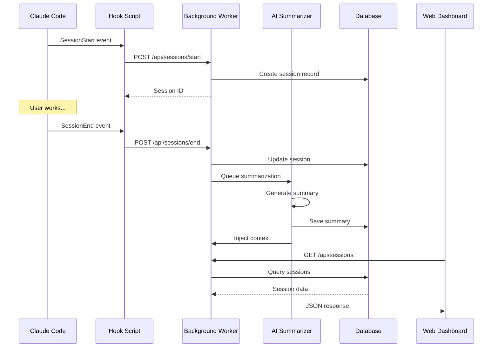

# 🏗️ Architecture

<div align="center">

[🏠 Home](../../README.md) • [📚 Documentation](../README.md) • [🔌 API Reference](api-reference.md) • [🤝 Contributing](contributing.md)

</div>

---

## 📋 Table of Contents

- [System Overview](#system-overview)
- [Components](#components)
- [Data Flow](#data-flow)
- [Database Schema](#database-schema)
- [API Architecture](#api-architecture)
- [Security](#security)

---

## System Overview

MemCTX consists of three main components:

```
┌─────────────────────────────────────────────────────────┐
│                     Claude Code                         │
│                  (SessionStart Hook)                    │
└────────────────────┬────────────────────────────────────┘
                     │
                     ▼
┌─────────────────────────────────────────────────────────┐
│                  Background Worker                      │
│  ┌──────────────┐  ┌──────────────┐  ┌──────────────┐  │
│  │   Session    │  │      AI      │  │   Database   │  │
│  │   Tracker    │─▶│ Summarizer   │─▶│   Manager    │  │
│  └──────────────┘  └──────────────┘  └──────────────┘  │
│                                                         │
│  ┌──────────────────────────────────────────────────┐  │
│  │              REST API Server                     │  │
│  └──────────────────────────────────────────────────┘  │
└────────────────────┬────────────────────────────────────┘
                     │
                     ▼
┌─────────────────────────────────────────────────────────┐
│                  Web Dashboard                          │
│  ┌──────────────┐  ┌──────────────┐  ┌──────────────┐  │
│  │   Session    │  │   Project    │  │   Settings   │  │
│  │     View     │  │   Manager    │  │   Editor     │  │
│  └──────────────┘  └──────────────┘  └──────────────┘  │
└─────────────────────────────────────────────────────────┘
```

---

## Components

### 1. Claude Code Hook

**Location:** `~/.claude/settings.json`

**Purpose:** Captures session lifecycle events

**Implementation:**

```json
{
  "hooks": {
    "SessionStart": {
      "command": "memctx-hook session-start",
      "blocking": false
    },
    "SessionEnd": {
      "command": "memctx-hook session-end",
      "blocking": false
    }
  }
}
```

**Events Captured:**
- Session start timestamp
- Project path
- Git branch
- Initial context

### 2. Background Worker

**Location:** `artifacts/claudectx-backup/worker/`

**Purpose:** Process sessions and manage data

**Key Modules:**

```typescript
// Session Tracker
class SessionTracker {
  async startSession(data: SessionStartData): Promise<Session>
  async endSession(sessionId: string): Promise<void>
  async updateSession(sessionId: string, updates: Partial<Session>): Promise<void>
}

// AI Summarizer
class AISummarizer {
  async summarize(session: Session): Promise<Summary>
  async batchSummarize(sessions: Session[]): Promise<Summary[]>
}

// Database Manager
class DatabaseManager {
  async saveSession(session: Session): Promise<void>
  async getSession(id: string): Promise<Session | null>
  async listSessions(filters: Filters): Promise<Session[]>
}
```

**Process Flow:**

```
1. Receive session start event
2. Create session record
3. Track session activity
4. On session end:
   a. Calculate duration
   b. Queue for summarization
   c. Generate AI summary
   d. Update database
   e. Inject context for next session
```

### 3. REST API Server

**Location:** `artifacts/claudectx-backup/worker/api.ts`

**Purpose:** Expose data to dashboard and CLI

**Endpoints:**

```typescript
// Health check
GET /api/health

// Sessions
GET /api/sessions
GET /api/sessions/:id
POST /api/sessions
PUT /api/sessions/:id
DELETE /api/sessions/:id

// Projects
GET /api/projects
GET /api/projects/:id
POST /api/projects
PUT /api/projects/:id
DELETE /api/projects/:id

// Summarization
POST /api/summarize/:sessionId
GET /api/summarize/status/:jobId

// Configuration
GET /api/config
PUT /api/config
```

### 4. Web Dashboard

**Location:** `artifacts/claudectx-backup/dashboard/`

**Purpose:** Visual interface for session management

**Tech Stack:**
- React 18
- TypeScript
- Vite
- TailwindCSS

**Key Features:**
- Real-time session updates
- AI summary display
- Project filtering
- Tag management
- Export functionality

---

## Data Flow

### Session Lifecycle



### Summarization Pipeline

```
┌─────────────────┐
│  Session End    │
└────────┬────────┘
         │
         ▼
┌─────────────────┐
│  Queue Job      │
└────────┬────────┘
         │
         ▼
┌─────────────────┐
│  Extract Data   │
│  - Duration     │
│  - Files        │
│  - Commands     │
│  - Git changes  │
└────────┬────────┘
         │
         ▼
┌─────────────────┐
│  Call Claude    │
│  API            │
└────────┬────────┘
         │
         ▼
┌─────────────────┐
│  Parse Summary  │
│  - Title        │
│  - Tasks        │
│  - Decisions    │
│  - Next steps   │
└────────┬────────┘
         │
         ▼
┌─────────────────┐
│  Save to DB     │
└────────┬────────┘
         │
         ▼
┌─────────────────┐
│  Inject Context │
│  to CLAUDE.md   │
└─────────────────┘
```

---

## Database Schema

**Technology:** SQLite

**Location:** `~/.memctx/sessions.db`

### Tables

#### sessions

```sql
CREATE TABLE sessions (
  id TEXT PRIMARY KEY,
  projectId TEXT NOT NULL,
  startTime INTEGER NOT NULL,
  endTime INTEGER,
  duration INTEGER,
  branch TEXT,
  summary TEXT,
  tags TEXT, -- JSON array
  notes TEXT,
  metadata TEXT, -- JSON object
  createdAt INTEGER NOT NULL,
  updatedAt INTEGER NOT NULL,
  FOREIGN KEY (projectId) REFERENCES projects(id)
);

CREATE INDEX idx_sessions_project ON sessions(projectId);
CREATE INDEX idx_sessions_start ON sessions(startTime);
CREATE INDEX idx_sessions_tags ON sessions(tags);
```

#### projects

```sql
CREATE TABLE projects (
  id TEXT PRIMARY KEY,
  name TEXT NOT NULL,
  path TEXT NOT NULL UNIQUE,
  description TEXT,
  tags TEXT, -- JSON array
  config TEXT, -- JSON object
  createdAt INTEGER NOT NULL,
  updatedAt INTEGER NOT NULL
);

CREATE INDEX idx_projects_path ON projects(path);
```

#### summaries

```sql
CREATE TABLE summaries (
  id TEXT PRIMARY KEY,
  sessionId TEXT NOT NULL UNIQUE,
  title TEXT NOT NULL,
  completed TEXT, -- JSON array
  nextSteps TEXT, -- JSON array
  blockers TEXT, -- JSON array
  decisions TEXT, -- JSON array
  model TEXT NOT NULL,
  tokens INTEGER,
  createdAt INTEGER NOT NULL,
  FOREIGN KEY (sessionId) REFERENCES sessions(id) ON DELETE CASCADE
);

CREATE INDEX idx_summaries_session ON summaries(sessionId);
```

---

## API Architecture

### Request/Response Format

**Standard Response:**

```typescript
interface ApiResponse<T> {
  success: boolean
  data?: T
  error?: string
  meta?: {
    total?: number
    page?: number
    limit?: number
  }
}
```

**Error Response:**

```typescript
interface ErrorResponse {
  success: false
  error: string
  code: string
  details?: any
}
```

### Authentication

Currently no authentication (local-only).

Future: API key authentication for remote access.

### Rate Limiting

- 100 requests per minute per client
- 10 concurrent summarization jobs

---

## Security

### Data Storage

- All data stored locally in `~/.memctx/`
- SQLite database with file permissions `600`
- No data sent to external services (except Claude API for summarization)

### API Key Handling

- Stored in config file with `600` permissions
- Never logged or exposed in API responses
- Loaded from environment variable or config

### Input Validation

- All API inputs validated with Zod schemas
- SQL injection prevention via parameterized queries
- Path traversal prevention

### Process Isolation

- Worker runs as separate process
- No elevated privileges required
- Graceful shutdown on SIGTERM/SIGINT

---

## Next Steps

- [🔌 API Reference](api-reference.md) - Detailed API documentation
- [🤝 Contributing](contributing.md) - Contribute to MemCTX
- [🔧 Development Setup](development.md) - Set up dev environment

---

<div align="center">

**Questions?** [Open an issue](https://github.com/bbhunterpk-ux/memctx/issues) • [Join discussions](https://github.com/bbhunterpk-ux/memctx/discussions)

</div>
